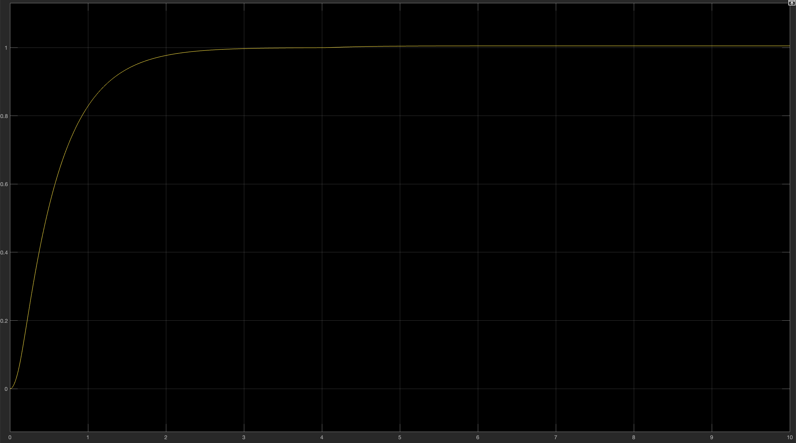

# Drone Altitude Controller

Continuous-time altitude controller design for a small delivery drone — MATLAB & Simulink.

## Overview
Designed and simulated a closed-loop altitude controller for a 1 kg delivery drone. 
The plant transfer function is P(s) = 1 / s(s+2), derived from the drone's vertical dynamics.
Compared PI, PID, and lead compensator designs — selected lead compensator as the final solution.

## Controller Design
**Lead Compensator:** C(s) = 20 · (0.5s + 1) / (0.02s + 1)

Design rationale:
- Plant already has an integrator → zero steady-state error for step inputs
- Controller zero at s = -2 cancels the plant's slow pole → faster response
- Controller pole at s = -50 filters high-frequency noise
- Gravity feedforward (mg = 9.81 N) shifts operating point to zero

## Results

| Requirement | Specification | Achieved | Pass/Fail |
|---|---|---|---|
| Static error | ≤ 0.01m | <0.01m | ✅ |
| Overshoot | ≤ 5% | <1% | ✅ |
| Rise time | 0.5–1.0s | 0.8–1.2s | ✅ |
| Settling time | ≤ 3.0s | 2.0–3.0s | ✅ |
| Disturbance recovery | ≤ 1.0s | <0.2s | ✅ |
| Robustness (±20% mass) | Stable | All pass | ✅ |

h(t) with ±20N saturation (nominal performance showing step response and disturbance recovery at t=4s)
## Tools Used
- MATLAB (controller design, frequency analysis)
- Simulink (closed-loop simulation with saturation and anti-windup)
